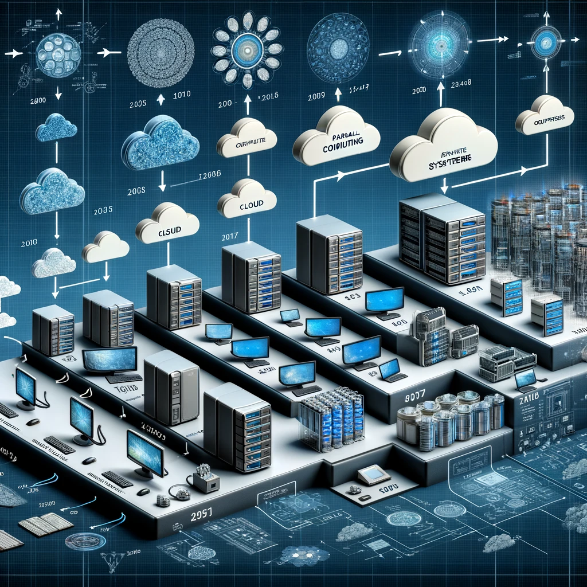

# Big Data Overview

## 1. Why Big Data?

- **Importance in Decision Making**: Big Data plays a crucial role in informing decision-making processes in various industries. By analyzing large datasets, organizations can uncover patterns, trends, and associations, especially relating to human behavior and interactions.

- **Innovation and Competitive Edge**: Companies leverage Big Data to innovate, improve operations, and gain a competitive edge. For instance, by analyzing customer data, businesses can personalize marketing strategies and improve customer experiences.

## 2. Applications of Big Data

- **Business Analytics**: In business, Big Data is used for market trend analysis, customer segmentation, fraud detection, and supply chain management.

- **Healthcare**: Big Data aids in disease prediction, patient care optimization, and personalized treatment strategies.

- **Government**: Used for urban planning, environmental protection, and public safety.

## 3. Definition of Big Data

- **Volume**: The sheer size of the data, often in petabytes and exabytes.

- **Velocity**: The speed at which new data is generated and needs to be processed.

- **Variety**: Different types of data (structured, unstructured, and semi-structured) including text, images, videos, and more.

## 4. Big Data Technology Stack

- **Storage Solutions**: Technologies like Hadoop Distributed File System (HDFS) and cloud storage solutions.

- **Processing Frameworks**: Tools like Apache Hadoop for processing large data sets.

- **Analytics Tools**: Software for data mining, predictive analytics, and machine learning.

## 5. Big Data Management

- **Data Security and Privacy**: Implementing robust security measures to protect sensitive data.

- **Scalability**: Ensuring infrastructure can scale up to handle growing data volumes.

- **Data Quality and Governance**: Maintaining the accuracy and consistency of data.

## Big Data Platforms

Big Data platforms are the backbone of modern data-driven decision-making and analytics, providing the necessary infrastructure to manage the volume, velocity, and variety of Big Data effectively. They offer several key features:

- **Massively Parallel Execution of Data Analysis**: Big Data platforms are designed to execute data analysis tasks in a massively parallel manner. This capability allows them to handle huge amounts of data efficiently. By distributing the workload across multiple processors, these platforms can process large data sets more quickly than traditional single-threaded systems.

- **Provisioning of Parallelized and Scalable Execution Systems**: These platforms provide systems that are not only parallelized but also scalable. This means they can adapt to increasing data volumes by expanding their processing capabilities. Such scalability is essential for maintaining performance as the demands on the system grow.

- **Real-Time Handling of Sensor Data**: Another critical feature of Big Data platforms is their ability to handle real-time sensor data. With the proliferation of IoT (Internet of Things) devices, the capability to process and analyze large streams of data from sensors in real time becomes increasingly important. This feature enables applications in areas like environmental monitoring, smart cities, and industrial automation.

## Utah Data Center - The NSA "Spy Center"

The Utah Data Center, also known as the NSA "Spy Center," is a prominent illustration of Big Data application in government intelligence and surveillance. Operated by the National Security Agency (NSA), this facility is tailored for extensive data collection and analysis. Its characteristics include:

- **Size and Power**: The data center is vast in size, requiring significant power for its computing and storage infrastructure. This highlights the immense data processing occurring within.

- **Data Processing Capabilities**: Equipped with some of the world's most powerful supercomputers, the center has the ability to process huge volumes of data, essential for NSA's intelligence and surveillance operations.

- **Global Surveillance and Intelligence Gathering**: The center is integral to NSA's worldwide intelligence efforts, capable of monitoring a broad spectrum of communications channels and electronic signals globally.

- **Role in National Security**: As a vital part of the U.S. national security infrastructure, the center engages in various intelligence activities, including counterterrorism and cybersecurity.

- **Public Scrutiny and Privacy Concerns**: The facility has been the focus of public scrutiny and debate, especially regarding privacy and civil liberties. The extensive data collection and surveillance capabilities pose questions about privacy and the limits of government surveillance.

Additional Information:

- The center encompasses approximately 100,000 square feet of data center space.
- It consumes about 65 megawatts of power.
- The facility, opened in October 2013, claims to host the world's fastest supercomputer, featuring 1 million Intel Xenon core processors and capable of ~100 Pflops (10^15 floating-point operations per second).
- The energy usage of the center is 65 MW continuously, requiring 17 million gallons of water daily.

## Architectural Models for Big Data Systems

There are several architectural models designed to handle the complexities of Big Data processing. Two prominent ones are:

### Lambda Architecture:

- **Batch Layer (Cold Path)**: This layer stores all incoming data in its raw form and processes it in batches. It is responsible for comprehensive data storage and batch processing.

- **Speed Layer (Hot Path)**: The speed layer analyzes data in real-time, providing up-to-the-minute insights and processing data as it arrives.

### Kappa Architecture:

In the Kappa Architecture model, all data flows through a single path using a stream processing system. This simplifies the architecture by removing the need for separate batch and real-time processing components, making it more streamlined and efficient.

These architectural models play a crucial role in managing and processing large volumes of data in Big Data systems. They provide a framework for handling data processing at scale and ensuring that organizations can derive valuable insights from their data in real-time or batch processing scenarios.

## The Path to Cloud Computing

Cloud computing is based on ideas and experiences from years of research in parallel computing and distributed systems. Cloud applications often follow a client-server model, with a thin-client on the user's machine and computations carried out on the cloud, usually by many machines in parallel.

### Parallel Computing

Parallel hardware and software systems enable solving problems that demand resources beyond a single system and reduce the time to obtain a solution. Parallelism involves using multiple computing resources simultaneously to solve complex problems more efficiently than with a single computer.

### Speed-up

The effectiveness of parallelization is measured by speed-up, where:
\[S(N) = \frac{T(1)}{T(N)}\]\

- **Amdahl’s Law**:
    - Amdahl’s Law is used to understand the potential speed-up in a parallel computing environment, especially when the problem or dataset size is fixed.
    - The law states that if α is the fraction of running time a sequential program spends on non-parallelizable segments, then the speed-up S(N) achieved by using NN parallel processors is given by:
      \[S(N) = \frac{1}{α + \frac{1 - α}{N}}\]
    - This formula shows that the speed-up of a program using multiple processors in parallel computing is limited by the sequential fraction of the program. In simple terms, even if you add more processors, the portion of the task that cannot be parallelized sets a limit to the overall speed-up you can achieve.

- **Gustafson’s Law**:
    - Gustafson’s Law shifts the focus from fixed problem size to fixed computing time, allowing the problem or dataset size to be arbitrarily large.
    - According to this law, the scaled speed-up S(N) with NN parallel processes is given by:
      \[S(N) = α + N(1 - α) = N - α(N - 1)\]
    - This implies that more computing power (more processors) will enable the analysis of larger datasets or more in-depth analysis within the same time frame. The law suggests that the limitations of the sequential part of a code can be balanced by increasing the problem size.

These laws provide a framework for understanding the benefits and limitations of parallel processing in computing environments. Amdahl’s Law emphasizes the constraint imposed by the non-parallelizable portion of a task, while Gustafson’s Law highlights the advantages of parallel processing in scaling up the problem size.

### Parallelism

In data parallelism, data is partitioned into several blocks, and these blocks are processed in parallel. This is known as Single Program Multiple Data (SPMD), where multiple copies of the same program run concurrently, each on a different data block.

#### Example of Speed-up Calculation

Consider a task that takes 100 seconds to complete sequentially (T(1) = 100s).
If the same task is parallelized across 10 machines and now takes 15 seconds (T(10) = 15s), the speed-up, S(10), would be approximately 6.67. This means the task is approximately 6.67 times faster when parallelized across 10 machines.

