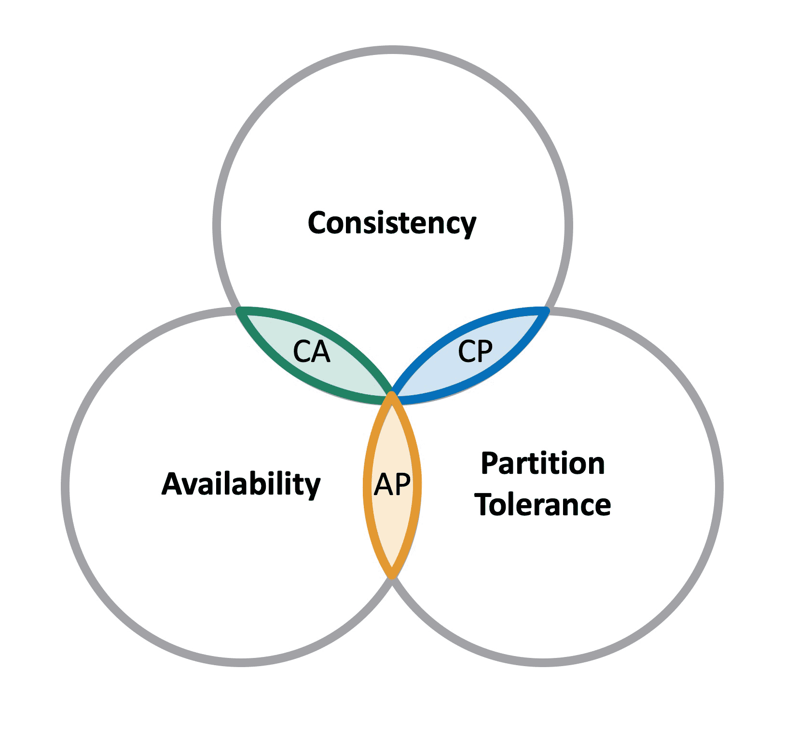

# Big Data Overview

## 1. Why Big Data?

- **Importance in Decision Making**: Big Data plays a crucial role in informing decision-making processes in various industries. By analyzing large datasets, organizations can uncover patterns, trends, and associations, especially relating to human behavior and interactions.

- **Innovation and Competitive Edge**: Companies leverage Big Data to innovate, improve operations, and gain a competitive edge. For instance, by analyzing customer data, businesses can personalize marketing strategies and improve customer experiences.

## 2. Applications of Big Data

- **Business Analytics**: In business, Big Data is used for market trend analysis, customer segmentation, fraud detection, and supply chain management.

- **Healthcare**: Big Data aids in disease prediction, patient care optimization, and personalized treatment strategies.

- **Government**: Used for urban planning, environmental protection, and public safety.

## 3. Definition of Big Data

- **Volume**: The sheer size of the data, often in petabytes and exabytes.

- **Velocity**: The speed at which new data is generated and needs to be processed.

- **Variety**: Different types of data (structured, unstructured, and semi-structured) including text, images, videos, and more.

## 4. Big Data Technology Stack

- **Storage Solutions**: Technologies like Hadoop Distributed File System (HDFS) and cloud storage solutions.

- **Processing Frameworks**: Tools like Apache Hadoop for processing large data sets.

- **Analytics Tools**: Software for data mining, predictive analytics, and machine learning.

## 5. Big Data Management

- **Data Security and Privacy**: Implementing robust security measures to protect sensitive data.

- **Scalability**: Ensuring infrastructure can scale up to handle growing data volumes.

- **Data Quality and Governance**: Maintaining the accuracy and consistency of data.

## Big Data Platforms

Big Data platforms are the backbone of modern data-driven decision-making and analytics, providing the necessary infrastructure to manage the volume, velocity, and variety of Big Data effectively. They offer several key features:

- **Massively Parallel Execution of Data Analysis**: Big Data platforms are designed to execute data analysis tasks in a massively parallel manner. This capability allows them to handle huge amounts of data efficiently. By distributing the workload across multiple processors, these platforms can process large data sets more quickly than traditional single-threaded systems.

- **Provisioning of Parallelized and Scalable Execution Systems**: These platforms provide systems that are not only parallelized but also scalable. This means they can adapt to increasing data volumes by expanding their processing capabilities. Such scalability is essential for maintaining performance as the demands on the system grow.

- **Real-Time Handling of Sensor Data**: Another critical feature of Big Data platforms is their ability to handle real-time sensor data. With the proliferation of IoT (Internet of Things) devices, the capability to process and analyze large streams of data from sensors in real time becomes increasingly important. This feature enables applications in areas like environmental monitoring, smart cities, and industrial automation.

## Utah Data Center - The NSA "Spy Center"

The Utah Data Center, also known as the NSA "Spy Center," is a prominent illustration of Big Data application in government intelligence and surveillance. Operated by the National Security Agency (NSA), this facility is tailored for extensive data collection and analysis. Its characteristics include:

- **Size and Power**: The data center is vast in size, requiring significant power for its computing and storage infrastructure. This highlights the immense data processing occurring within.

- **Data Processing Capabilities**: Equipped with some of the world's most powerful supercomputers, the center has the ability to process huge volumes of data, essential for NSA's intelligence and surveillance operations.

- **Global Surveillance and Intelligence Gathering**: The center is integral to NSA's worldwide intelligence efforts, capable of monitoring a broad spectrum of communications channels and electronic signals globally.

- **Role in National Security**: As a vital part of the U.S. national security infrastructure, the center engages in various intelligence activities, including counterterrorism and cybersecurity.

- **Public Scrutiny and Privacy Concerns**: The facility has been the focus of public scrutiny and debate, especially regarding privacy and civil liberties. The extensive data collection and surveillance capabilities pose questions about privacy and the limits of government surveillance.

Additional Information:

- The center encompasses approximately 100,000 square feet of data center space.
- It consumes about 65 megawatts of power.
- The facility, opened in October 2013, claims to host the world's fastest supercomputer, featuring 1 million Intel Xenon core processors and capable of ~100 Pflops (10^15 floating-point operations per second).
- The energy usage of the center is 65 MW continuously, requiring 17 million gallons of water daily.

## Architectural Models for Big Data Systems

There are several architectural models designed to handle the complexities of Big Data processing. Two prominent ones are:

### Lambda Architecture:

- **Batch Layer (Cold Path)**: This layer stores all incoming data in its raw form and processes it in batches. It is responsible for comprehensive data storage and batch processing.

- **Speed Layer (Hot Path)**: The speed layer analyzes data in real-time, providing up-to-the-minute insights and processing data as it arrives.

### Kappa Architecture:

In the Kappa Architecture model, all data flows through a single path using a stream processing system. This simplifies the architecture by removing the need for separate batch and real-time processing components, making it more streamlined and efficient.

These architectural models play a crucial role in managing and processing large volumes of data in Big Data systems. They provide a framework for handling data processing at scale and ensuring that organizations can derive valuable insights from their data in real-time or batch processing scenarios.

## The Path to Cloud Computing

Cloud computing is based on ideas and experiences from years of research in parallel computing and distributed systems. Cloud applications often follow a client-server model, with a thin-client on the user's machine and computations carried out on the cloud, usually by many machines in parallel.

### Parallel Computing

Parallel hardware and software systems enable solving problems that demand resources beyond a single system and reduce the time to obtain a solution. Parallelism involves using multiple computing resources simultaneously to solve complex problems more efficiently than with a single computer.

### Speed-up

The effectiveness of parallelization is measured by speed-up, represented as **S(N) = T(1) / T(N)**, where **T(1)** is the execution time of the sequential computation, and **T(N)** is the execution time when **N** parallel computations are carried out. Amdahl’s Law and Gustafson’s Law guide understanding the efficiency gains through parallel processing.

#### Amdahl’s Law

Amdahl’s Law is used to understand the potential speed-up in a parallel computing environment, particularly when the problem or dataset size is fixed. It states that if **α** is the fraction of running time a sequential program spends on non-parallelizable segments, then the speed-up **S(N)** achieved by using **N** parallel processors is given by:

**S(N) = 1 / (α + (1 - α) / N)**

This formula shows that the speed-up of a program using multiple processors in parallel computing is limited by the sequential fraction of the program. In simple terms, even if you add more processors, the portion of the task that cannot be parallelized sets a limit to the overall speed-up you can achieve.

#### Gustafson’s Law

Gustafson’s Law shifts the focus from fixed problem size to fixed computing time, allowing the problem or dataset size to be arbitrarily large. According to this law, the scaled speed-up **S(N)** with **N** parallel processes is given by:

**S(N) = α + N * (1 - α) = N - α * (N - 1)**

This implies that more computing power (more processors) will enable the analysis of larger datasets or more in-depth analysis within the same time frame. The law suggests that the limitations of the sequential part of a code can be balanced by increasing the problem size.

These laws provide a framework for understanding the benefits and limitations of parallel processing in computing environments. Amdahl’s Law emphasizes the constraint imposed by the non-parallelizable portion of a task, while Gustafson’s Law highlights the advantages of parallel processing in scaling up the problem size.

### Parallelism:

- **Data parallelism** involves partitioning data into several blocks processed in parallel.

- **Single Program Multiple Data (SPMD)** entails running multiple copies of the same program concurrently, each on a different data block.

### Example of Speed-up Calculation

Consider a task that takes 100 seconds to complete sequentially (T(1) = 100s).
If the same task is parallelized across 10 machines and now takes 15 seconds (T(10) = 15s), the speed-up, S(10), would be 100 / 15 ≈ 6.67. This means the task is approximately 6.67 times faster when parallelized across 10 machines.

## Distributed Systems

Distributed systems are crucial for data-centric applications where disk transfer rates are bottlenecks in large-scale data management. By parallelizing and distributing data across many machines, these bottlenecks are eliminated. Some key points about distributed systems include:

- **Write once, read many distributed storage systems** are appropriate for large files that are written once and then repeatedly scanned.
- Since bandwidth is a scarce resource, programs should be "pushed" near the data they need to access. For example, a typical setting of a Google data center includes about 40 servers per rack, 150 racks per data center (cluster), and roughly 6000 servers per data center. Google's exact number of data centers is not disclosed, but estimates suggest 150-200 data centers.

### Replication and Consistency

Distribution of data offers the opportunity to enhance security through replication. Some key points related to replication and consistency include:

- **Replication** involves copying data from one machine (A) to a remote machine (B).
- **Consistency** is the ability of a system to behave as if each user's transaction always runs in isolation from others and never fails. This is difficult to achieve in centralized systems due to multi-user access and concurrency and even more challenging in distributed systems.

### Consistency Management

A consistency model establishes rules for the visibility and order of updates. Some key aspects of consistency management include:

- For instance, if row X is replicated on nodes M and N, and client A writes row X to node N, it's uncertain if client B will see this write when reading from node M after some time.
- **Strong consistency** requires synchronous replication and heavy locking mechanisms. SQL databases favor this approach. The two-phase commit protocol is used to ensure strong consistency in distributed settings.
- **Weak consistency** accepts serving some requests with outdated data. 
- **Eventual consistency** guarantees the system will converge to a consistent state based on the last version.

### Availability

Availability is the capacity of a distributed system to minimize latency as much as possible. Some considerations related to availability include:

- **Failure detection** involves monitoring nodes to detect failures early, usually via heartbeat messages, and designing quick restart protocols.
- Replication can be either **synchronous** or **asynchronous**.
- Traditionally, availability is expected to be extremely high (99.999%), but in large node systems, there is always a chance of a node being down or network disruptions. Thus, systems are designed to be resilient in the face of network disruptions.

These concepts are integral to understanding distributed computing, where data and computation are spread across multiple nodes to enhance performance, reliability, and scalability. Replication and consistency are key to ensuring that the distributed system operates effectively and maintains integrity, while availability ensures that the system remains operational and accessible despite potential failures or disruptions.

## The CAP Theorem by Eric Brewer in 2000

The CAP Theorem, formulated by Eric Brewer in 2000, is a fundamental principle in the design and operation of distributed systems. It describes the trade-offs between three essential properties of distributed systems:

### Consistency

- **Consistency**: Every user sees the same data at each time. This means that all nodes in a distributed system reflect the same data at any given moment, ensuring that any read operation returns the most recent write.

### Availability

- **Availability**: Each user has read and write access to the data at all times. Availability ensures that every request receives a response about whether it was successful or failed, but it does not guarantee that the returned data is the most recent version.

### Partition Tolerance

- **Partition Tolerance**: The system continues to operate despite network failures that prevent some of the nodes from communicating with each other. Partition tolerance implies that the system can handle and recover from network partitions while continuing to function.

The CAP Theorem posits that a distributed system can only guarantee two of these three properties simultaneously. For example, a system can ensure consistency and partition tolerance, but this might compromise availability. Similarly, a system that prioritizes availability and partition tolerance might have to sacrifice consistency.

The choice among these three properties depends on the specific requirements and constraints of the system being designed. This theorem is crucial for understanding the design trade-offs in distributed systems, particularly those involving large-scale data storage and processing.

## Partition Tolerance

**Partition tolerance** in distributed systems refers to the ability of the system to scale over multiple network nodes. It's a key aspect of the CAP Theorem, ensuring that the system continues to operate despite partitions (i.e., breakdowns in communication) between nodes in a network.

### Relational Databases

**Relational Database Management Systems (RDBMS)** store data in a collection of tables and use relational operators for data manipulation. They primarily employ SQL as their query language, hence also known as SQL databases.

### RDBMS: The Challenge is Scalability

The main scalability challenge in RDBMS is handling large data sets. The **master-slave architecture**, where all writes are to the master and reads from replicated slaves, can cause problems as the master needs to duplicate data to slaves. **Partitioning or sharding** scales well for both reads and writes but requires the application to be partition-aware and can lead to a loss of referential integrity across shards.

### “Traditional” Scale-Out Approach

This approach assumes the use of a single RDBMS system. It involves adding multiple slave databases to parallelize read access, with writes handled by the RDBMS master. The next steps include adding an in-memory cache for reads (which can lead to consistency issues) and beefing up the master (scaling vertically), which can be expensive. Data is often denormalized to optimize for specific access patterns.

### Hyper-Scale Architecture

**Hyper-scale architecture** contrasts with conventional architecture by prioritizing high scalability and availability. It is characteristic of Web 2.0 and cloud computing, integrating compute and storage nodes in the same unit. This architecture handles structured, semi-structured, and unstructured data. It is suited for **NoSQL databases**, which do not require a fixed table schema and are better for certain problems where non-relational storage solutions are more efficient.

These concepts are fundamental in understanding modern data management and storage systems, especially in the context of large-scale, distributed environments. Partition tolerance ensures system resilience in the face of network issues, while relational databases and RDBMS focus on structured data management with scalability as a primary challenge. The traditional scale-out approach and hyper-scale architecture provide different methodologies for handling these challenges, with the latter being more aligned with current cloud computing and big data trends.

## Cloud Storage from Theory to Practice

### NoSQL

NoSQL databases relax one or more of the ACID (Atomicity, Consistency, Isolation, Durability) properties. They feature a distributed, fault-tolerant architecture and are scalable. NoSQL databases do not typically use the concept of joins.

### Distributed Access Structures

In NoSQL, indexing and hashing-based techniques are common. Consistent hashing and tree-based techniques like distributed B-Trees are examples of distributed access structures used in NoSQL databases.

### Indexing

Indexing is used to efficiently locate and access data in a database. It associates each key with the physical address of the corresponding value, enabling operations like insertion, deletion, key search, and optionally range search. Indexing helps in quickly finding data without scanning the entire dataset.

#### Hashing (Centralized)

In centralized hashing, a hash function is used to map data to buckets. However, it faces issues of dynamicity and inconsistencies, especially in distributed systems.

#### Hashing (Distributed)

The basic idea is to use the same hash function, with servers replacing buckets. A common approach is to use the modulo function, mapping a key-value pair to a server. However, this can become inconsistent if the number of servers changes or if an invalid value for N is used by a client.

### Consistent Hashing

Consistent hashing is a technique used in distributed systems for efficiently allocating and locating nodes (servers) in a network. It ensures that adding or removing a node does not significantly change the key-to-server mapping.

#### Example for Indexing and Hashing

- **Indexing**: Think of a library catalog as an index. If you have a book title (key), the catalog (index) helps you find the physical location (value) of the book in the library.
- **Hashing (Centralized)**: In a centralized system, a hash function converts a data item (like a username) into a hash code, corresponding to a specific storage location (like a particular server).
- **Hashing (Distributed)**: In a network of computers (servers), a hash function determines which computer should store a piece of data, distributing data evenly across the network.

### Refinements

#### Replication for Fault Tolerance

When a server fails, the system automatically replicates its data to the next server on the ring, ensuring data availability and resilience in case of server failures.

#### Load Balancing with Virtual Nodes

Servers are mapped to multiple points on the ring (virtual nodes), balancing the load more evenly across the network. More virtual nodes mean more load for a server, aiding data relocation if a server fails. This is particularly useful in large-scale, heterogeneous environments.

### Hash Directory Management

#### Master Node Approach

The hash directory can be placed on a specific 'Master' node, acting as a load balancer. However, this approach raises scalability issues.

#### Ring-based Record Keeping

Each node records its successor on the ring, but this may require O(N) messages for routing queries and is not resilient to failures.

#### Logging Chosen Nodes

Each node records log N carefully chosen other nodes (common in Peer-to-Peer networks), ensuring O(log N) messages for routing queries. This is a convenient trade-off for dynamic networks.

#### Full Duplication

The hash directory is fully duplicated at each node, as seen in systems like Dynamo. This ensures routing with just 1 message but requires a heavy maintenance protocol, often achieved through gossiping.

## Amazon Dynamo

Amazon Dynamo is a distributed storage system designed to prioritize high availability, making it particularly suitable for applications like shopping carts in e-commerce websites. Here's a detailed breakdown of its key features:

### Hash Directory Maintenance

- **Method**: Dynamo duplicates and maintains the hash directory at each node.
- **Communication**: Uses gossiping protocols, allowing queries to be routed to the correct server with just one message.
- **Advantage**: This approach enhances the system's efficiency in locating the correct node for any given data request.

### Data Replication

- **Replication Strategy**: The hosting server replicates 'N' copies of its objects on the 'N' distinct nodes that follow it on the ring.
- **Parameterization**: 'N' is an application-specific parameter, allowing customization based on the system's needs.
- **Fault Tolerance**: This replication enhances the system's resilience to node failures.

### Update Propagation

- **Method**: Updates are propagated asynchronously across the network.
- **Conflict Resolution**: This can result in update conflicts, which are resolved by the application at the time of reading.
- **Benefits and Challenges**: Asynchronous updates reduce latency but require robust conflict resolution mechanisms.

### Failure Detection

- **Mechanism**: Dynamo employs a fully distributed failure detection mechanism.
- **Node-Level Monitoring**: Failures are detected by individual nodes when they fail to communicate with others.
- **Resilience**: This decentralized approach ensures the system quickly adapts to changes in network topology due to node failures.

### Scalability Concerns

- **Operational Flow**: All operations in Dynamo follow a top-down path.
- **Potential Issue**: While this structure is generally efficient, it could become a limiting factor in terms of scalability under certain conditions.

In summary, Amazon Dynamo's architecture is tailored to ensure high availability and efficient data management in a distributed environment. Its design choices around hash directory management, data replication, update propagation, and failure detection make it particularly suitable for large-scale, dynamic systems where high availability and fault tolerance are critical.

## B-Tree (Centralized and Distributed)

### Centralized B-Tree

Traditional B-trees are centralized, where all operations are controlled from a single point. This can create bottlenecks, especially in large-scale systems.

### Distributed B-Tree

In distributed environments, B-trees are adapted to work across multiple nodes. This involves caching parts of the tree structure on client nodes, replicating upper levels of the tree for fault tolerance, and using routing tables at each node for efficient navigation.

## BigTable and HBase

### Overview

Both BigTable and HBase can be seen as distributed map structures with features derived from B-trees and non-dense indexed files.

### Architecture

They use a master-many servers architecture. The master node maintains the root and handles administrative tasks, while scalability is achieved through client-side caching.

### Data Model

They follow a column-oriented database model, with a table structure that includes column families and individual columns. Each column family is stored in a separate file.

## BigTable and Apache HBase

### Column Versioning

They support versioned columns, allowing for historical data tracking.

### Architecture

Based on a distributed file system with region servers for data distribution and an in-memory cache for improved query performance.

### Query Types

Supports range scans, individual row retrievals, and full scans.

## HBase

### Storage Format

Uses a column-oriented storage format.

### Data Locality

HBase is aware of data locality, which is advantageous for distributed access. It supports MapReduce-style access, replication, and fault tolerance.

### Data Model

Internally, HBase uses a sorted map structure with row keys pointing to sorted maps of columns, each containing values with timestamps.

## HBase Regions

### Region Definition

Regions in HBase are contiguous ranges of rows stored together, enabling efficient data access.

### Auto-sharding

HBase automatically shards data into regions.

### Region Size

Typically, each server hosts between 10 to 1000 regions, each ranging between 1 and 2 GB, depending on the hardware.

### Query Performance

These regions play a key role in optimizing query performance and handling time-series data.

## Query Performance and Time-Series Data

- Time-series data, often sequential and time-stamped, is prevalent in various applications like financial markets, sensor data, and more.
- Optimizing query performance for time-series data involves specialized data structures and indexing strategies. Systems often employ techniques like down-sampling and roll-ups to manage large volumes of such data efficiently.

## Apache Cassandra

- Apache Cassandra is a distributed NoSQL database known for its scalability and high availability without compromising performance.
- It is particularly well-suited for handling large amounts of data across multiple commodity servers, providing robust support for clusters spanning multiple datacenters.
- Cassandra offers a schema-free data model, making it a flexible solution for various types of data.

## Google BigQuery

- Google BigQuery is a fully-managed, serverless data warehouse that enables scalable analysis of large datasets.
- It allows for SQL queries against massive datasets, handling the underlying infrastructure automatically.
- BigQuery is designed for speed and scalability, leveraging Google's infrastructure to analyze data in real-time.

## BigQuery Architecture

- The architecture of BigQuery is a columnar storage format, which allows for faster querying and data retrieval, especially for large datasets.
- It separates storage and compute, enabling users to scale each independently.
- BigQuery's design allows for high-speed data processing, making it ideal for analyzing large datasets quickly.

These tools and technologies are pivotal in the field of data management and analytics, offering scalable solutions for handling and analyzing large and complex datasets.

## Dremel: The Execution Engine

- Dremel is a scalable, interactive ad hoc query system for analysis of read-only nested data.
- It combines multi-level execution trees and columnar data layout to achieve high performance and scalability, particularly useful for data exploration and experimentation.

## Colossus

- Colossus is the successor to the Google File System (GFS), designed to manage petabytes of data and millions of operations per second.
- It provides fault tolerance and replication, crucial for maintaining data integrity and availability in large-scale systems.

## Borg

- Borg is a cluster management system used by Google to manage and schedule computational workloads across a large number of clusters.
- It is known for its efficiency and ability to handle a vast range of applications, from long-running services to batch jobs.

## Jupiter: The Network

- Jupiter is Google's data center network, offering unprecedented scale and bandwidth.
- It is designed to efficiently handle the massive amounts of data required by Google's extensive range of services.

## BigQuery: The Service

- BigQuery is a fully-managed, serverless data warehouse that enables scalable analysis of big data.
- It is known for its fast SQL query execution and ease of use, making it a popular choice for data analysis tasks.

Each of these components plays a crucial role in Google's infrastructure, supporting its ability to process and analyze vast amounts of data quickly and reliably.

## Distributed File Systems

- **Key Concept:** These systems are crucial for environments needing data storage and computation across various locations. They provide efficient data access and management while ensuring data integrity and fault tolerance.
- **Characteristics:** Typically, these systems are scalable, reliable, and built to handle large volumes of data across multiple machines.

## GFS: Motivation

- **Purpose:** GFS was developed to handle large datasets and workloads, characteristic of Google's massive data processing needs.
- **Goals:** The main goals were to ensure reliability and scalability, even when using inexpensive commodity hardware prone to failures.

## GFS: Assumptions

- **System Environment:** GFS assumed an operational environment with a high rate of component failures, thereby requiring a robust system architecture.
- **Hardware Utilization:** It was built on the premise of using cost-effective hardware, leading to an emphasis on fault tolerance and error handling in the design.

## GFS: Design Decisions

- **File Size Optimization:** GFS was optimized for large files and sequential read/write operations.
- **Simplicity:** The design prioritized simplicity, choosing to implement fewer features but ensuring high reliability and performance.
- **Data Management:** It was tailored to manage a smaller number of large files rather than a large number of small files.

## GFS: Architecture

- **Master-Slave Architecture:** GFS uses a single master and multiple chunk servers. The master handles metadata and orchestrates system activities, while the chunk servers store the actual data.
- **Performance and Reliability:** This architecture ensures efficient performance and robustness, essential for managing large-scale data processing and storage.

These insights provide a comprehensive understanding of the foundational elements and operational principles of Distributed File Systems and GFS, highlighting their importance in the domain of large-scale data management.
